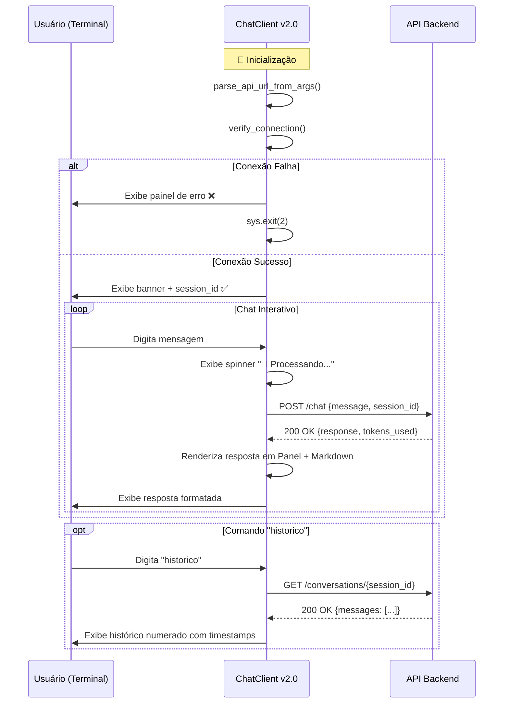

# 🤖 Gemini ChatBot - Cliente TUI (Text User Interface)

> Documentação técnica do cliente de terminal para interação com API de ChatBot  
> **Versão: 2.0.0** • **Atualização: Verificação de Conexão Automática**

```
┌─────────────────────────────────────────┐
│  🤖 Gemini ChatBot - Cliente TUI v2.0   │
│  Interface: Terminal Rico (Rich)        │
│  Protocolo: HTTP/REST + JSON            │
│  Feature Principal: Health Check Autom. │
└─────────────────────────────────────────┘
```

---

## 📑 Índice

1. [Visão Geral](#-visão-geral)
2. [Novidades da Versão 2.0](#-novidades-da-versão-20)
3. [Pré-requisitos](#-pré-requisitos)
4. [Instalação](#-instalação)
5. [Uso Rápido](#-uso-rápido)
6. [Configuração](#-configuração)
7. [Comandos Disponíveis](#-comandos-disponíveis)
8. [Interface do Usuário](#-interface-do-usuário)
9. [Verificação de Conexão](#-verificação-de-conexão)
10. [Comunicação com a API](#-comunicação-com-a-api)
11. [Tratamento de Erros](#-tratamento-de-erros)
12. [Arquitetura do Código](#-arquitetura-do-código)
13. [Exemplos de Uso](#-exemplos-de-uso)
14. [Solução de Problemas](#-solução-de-problemas)
15. [Referência da API](#-referência-da-api)
16. [Códigos de Saída](#-códigos-de-saída)
17. [Contribuindo](#-contribuindo)

---

## 👁️ Visão Geral

O **ChatClient TUI v2.0** é uma aplicação de linha de comando desenvolvida em Python que permite interagir com um backend de ChatBot através de uma interface de terminal rica e formatada, com **verificação automática de conexão** antes do início da sessão.

### ✨ Principais Características

| Característica | Descrição |
|---------------|-----------|
| 🎨 **Interface Rica** | Cores, formatação Markdown, painéis e animações via biblioteca `rich` |
| 🔌 **Health Check Automático** | Verifica conectividade com múltiplos endpoints antes de iniciar o chat |
| 🔗 **Comunicação HTTP Resiliente** | Requisições RESTful com timeout configurável e retry implícito |
| 🆔 **Sessões Isoladas** | UUID único por instância para isolamento de conversas |
| 🛡️ **Tratamento Granular de Erros** | Diferenciação entre erros de rede, API e interrupções do usuário |
| ⚡ **Feedback Visual em Tempo Real** | Spinners de progresso, mensagens contextuais e painéis informativos |
| 🔧 **Configuração Flexível** | Suporte a variáveis de ambiente, argumentos posicionais e URLs completas |

### 🎯 Casos de Uso

```bash
# Desenvolvimento local com verificação automática
python chat_client.py 127.0.0.1

# Acesso a servidor remoto com porta customizada
python chat_client.py 192.168.1.100 8080

# Deploy em produção com variável de ambiente
API_URL=https://api.producao.com python chat_client.py ignored

# Script automatizado com verificação prévia
python -c "
from chat_client import ChatClient, check_api_connection
client = ChatClient('10.0.0.1')
if client.verify_connection(show_progress=False):
    # Prosseguir com lógica automatizada
    pass
"
```

---

## 🚀 Novidades da Versão 2.0

### ✅ Verificação Automática de Conexão

```python
# Antes (v1.0): Tentava enviar mensagem e falhava silenciosamente
client.start_chat()  # ❌ Erro só aparecia ao digitar primeira mensagem

# Agora (v2.0): Verifica conexão ANTES de iniciar o chat
if not client.verify_connection():
    sys.exit(2)  # ✅ Falha rápida com feedback claro
client.start_chat()
```

### ✅ Múltiplos Endpoints de Health Check

```python
HEALTH_ENDPOINTS = ["/health", "/", "/chat", "/api/health"]
# Testa sequencialmente até encontrar um endpoint respondendo
```

### ✅ Spinner de Progresso com Rich Progress

```python
from rich.progress import Progress, SpinnerColumn, TextColumn

with Progress(SpinnerColumn(), TextColumn("{task.description}")) as progress:
    task = progress.add_task("Verificando conexão...", total=None)
    # Operação assíncrona...
```

### ✅ Códigos de Saída Semânticos

| Código | Significado | Uso |
|--------|-------------|-----|
| `0` | ✅ Sucesso | Chat encerrado normalmente |
| `1` | ❌ Erro geral | Parâmetros inválidos, exceção não tratada |
| `2` | 🔌 Conexão falhou | `verify_connection()` retornou `False` |
| `130` | ⚠️ Interrupt | Usuário pressionou `Ctrl+C` |

### ✅ Funções Auxiliares Exportáveis

```python
# Funções utilitárias agora podem ser importadas para testes/scripts
from chat_client import check_api_connection, format_url

ok, msg = check_api_connection("http://localhost:8000")
print(f"Status: {msg}")
```

### ✅ Painéis Pré-definidos para Consistência Visual

```python
PAINEL_BANNER = Panel.fit(...)  # Reutilizável em toda a aplicação
PAINEL_AJUDA = Panel(...)       # Mantém padrão visual consistente
```

---

## ⚙️ Pré-requisitos

### Software Necessário

| Componente | Versão Mínima | Como Verificar |
|-----------|--------------|----------------|
| Python | 3.8+ | `python --version` |
| pip | 21.0+ | `pip --version` |

### Dependências Python

```txt
# requirements.txt
requests>=2.28.0    # Cliente HTTP para comunicação com a API
rich>=13.0.0        # Biblioteca para TUI formatada (v2.0 requer Progress)
```

> ⚠️ **Nota**: A versão 2.0 requer `rich>=13.0.0` para suporte ao módulo `rich.progress`.

### Instalação das Dependências

```bash
# Via pip tradicional
pip install -r requirements.txt

# Via uv (gerenciador moderno recomendado)
uv pip install -r requirements.txt

# Instalação individual com versão mínima
pip install "requests>=2.28.0" "rich>=13.0.0"
```

---

## 🚀 Instalação

### Método 1: Clone do Repositório (Recomendado)

```bash
# Clonar repositório
git clone https://github.com/seu-usuario/gemini-chatbot.git
cd gemini-chatbot/client

# Instalar dependências
pip install -r requirements.txt

# Verificar instalação e versão
python chat_client.py 2>&1 | head -3
# Output esperado: "❌ Parâmetros insuficientes" + instruções de uso
```

### Método 2: Instalação Direta via curl

```bash
# Baixar arquivos do cliente
curl -O https://raw.githubusercontent.com/seu-usuario/gemini-chatbot/main/client/chat_client.py
curl -O https://raw.githubusercontent.com/seu-usuario/gemini-chatbot/main/client/requirements.txt

# Instalar dependências
pip install -r requirements.txt

# Testar execução
python chat_client.py 127.0.0.1
```

### Método 3: Via uv com Ambiente Isolado

```bash
# Instalar uv (se ainda não tiver)
pip install uv

# Criar ambiente virtual isolado
uv venv
source .venv/bin/activate  # Linux/Mac
# ou
.venv\Scripts\activate  # Windows

# Instalar dependências no ambiente virtual
uv pip install -r requirements.txt

# Executar com ambiente ativado
python chat_client.py 192.168.1.100
```

---

## 🎮 Uso Rápido

### Sintaxe Básica

```bash
python chat_client.py <IP_OU_HOST> [PORTA]
```

### Exemplos Práticos

```bash
# 🔹 Conectar ao localhost (porta padrão 8000)
python chat_client.py 127.0.0.1

# 🔹 Conectar com porta customizada
python chat_client.py 192.168.1.100 8080

# 🔹 Conectar a servidor remoto
python chat_client.py api.empresa.com

# 🔹 Usar URL completa via variável de ambiente
API_URL=https://api.producao.com:8443 python chat_client.py ignored

# 🔹 Executar apenas verificação de conexão (script)
python -c "
from chat_client import ChatClient
c = ChatClient('127.0.0.1')
exit(0 if c.verify_connection(show_progress=False) else 2)
"
```

### Fluxo de Interação Típico (v2.0)

```
$ python chat_client.py 192.168.1.100
┌─ 🚀 Inicializando ChatClient TUI ──┐
│ Servidor: 192.168.1.100:8000      │
│ API_URL env: não definido          │
└────────────────────────────────────┘
⠋ Verificando conexão com http://192.168.1.100:8000...
┌─ Conexão Estabelecida ─────────────┐
│ ✅ Conectado via /health (HTTP 200)│
│ Session ID: a1b2c3d4-e5f6-...      │
└────────────────────────────────────┘
┌─ 🤖 Gemini ChatBot ────────────────┐
│ Digite 'sair' para encerrar...    │
└────────────────────────────────────┘

Você: Olá, como funciona machine learning?
⠋ 🤔 Processando sua mensagem...
┌─ 🤖 Assistente ──────────────────┐
│                                  │
│ Machine Learning é um campo...  │
│                                  │
│ • Coleta de dados               │
│ • Treinamento de modelos        │
│                                  │
└─ 🔢 Tokens: 156 ─────────────────┘

Você: sair
Até logo! 👋
$ echo $?
0  ← Encerramento bem-sucedido
```

---

## ⚙️ Configuração

### Prioridade de Configuração da URL da API

```
1️⃣ Variável de ambiente API_URL (maior prioridade)
   ↓
2️⃣ Argumentos de linha de comando: <IP> [PORTA]
   ↓
3️⃣ Fallback interno: http://localhost:8000
```

### Métodos de Configuração

#### Método 1: Argumentos de Linha de Comando

```bash
# Sintaxe completa
python chat_client.py <IP_OU_HOST> [PORTA]

# Exemplos
python chat_client.py 192.168.1.100
# → Conecta em: http://192.168.1.100:8000

python chat_client.py api.exemplo.com 8443
# → Conecta em: http://api.exemplo.com:8443

python chat_client.py https://api.segura.com
# → URL completa detectada, porta ignorada
# → Conecta em: https://api.segura.com
```

#### Método 2: Variável de Ambiente `API_URL`

```bash
# Linux/Mac (bash/zsh)
export API_URL="https://api.producao.com:8443"
python chat_client.py ignored  # Argumentos são ignorados

# Windows (CMD)
set API_URL=https://api.producao.com:8443
python chat_client.py ignored

# Windows (PowerShell)
$env:API_URL="https://api.producao.com:8443"
python chat_client.py ignored

# One-liner temporário
API_URL=http://teste.local:8000 python chat_client.py qualquer_coisa
```

#### Método 3: Configuração Programática

```python
from chat_client import ChatClient

# Opção A: Via argumentos (padrão)
client = ChatClient("192.168.1.100", porta=8080)

# Opção B: Via variável de ambiente (definida antes)
import os
os.environ["API_URL"] = "https://api.custom.com"
client = ChatClient("ignored")  # Será ignorado

# Opção C: Verificação sem iniciar chat interativo
if client.verify_connection(show_progress=False):
    print("✅ API disponível")
    # Prosseguir com lógica customizada
```

### Tabela de Configurações

| Configuração | Tipo | Padrão | Descrição |
|-------------|------|--------|-----------|
| `API_URL` | Variável de ambiente | `None` | URL completa da API (sobrescreve IP/porta) |
| `ip_servidor` | Argumento posicional | *Obrigatório* | IP, hostname ou URL completa |
| `porta` | Argumento opcional | `8000` | Porta da API (ignorado se URL completa) |
| `session_id` | Gerado internamente | UUID v4 | Identificador único da sessão |
| `CONNECTION_TIMEOUT` | Constante interna | `5` | Timeout em segundos para health check |
| `HEALTH_ENDPOINTS` | Lista interna | `["/health","/","/chat","/api/health"]` | Endpoints testados sequencialmente |

---

## 🗂️ Comandos Disponíveis

### Comandos de Controle do Chat

| Comando | Sinônimos | Descrição | Exemplo de Output |
|---------|-----------|-----------|------------------|
| `sair` | `exit`, `quit` | Encerra a sessão de chat | `"Até logo! 👋"` |
| `ajuda` | `help` | Exibe menu de ajuda com comandos | Painel com lista de comandos |
| `historico` | — | Busca e exibe histórico do servidor | Lista formatada de mensagens |

> 💡 **Dica**: Comandos são **case-insensitive**. `SAIR`, `Sair` e `sair` funcionam igualmente.

### Comportamento de Entradas Especiais

| Entrada | Comportamento |
|---------|--------------|
| *(string vazia ou só espaços)* | Ignorada, novo prompt exibido |
| `Ctrl+C` | Interrupção graciosa com mensagem e `exit(130)` |
| Texto normal | Enviado como mensagem para a API via `POST /chat` |
| Erro de conexão durante chat | Exibe painel de erro e oferece opção de continuar |

### Exemplos de Perguntas

```text
• "Explique o que é machine learning"
• "Como funciona um neural network?"
• "Me ajude a debugar um código Python"
• "Quais são as melhores práticas para APIs REST?"
• "Crie um exemplo de classe em Python com herança"
• "Traduza este texto para inglês: ..."
```

---

## 🎨 Interface do Usuário

### Elementos Visuais com Rich

O cliente utiliza a biblioteca `rich` para proporcionar uma experiência de terminal enriquecida:

#### 📦 Painéis (Panels) Reutilizáveis

```python
# Banner inicial (PAINEL_BANNER)
Panel.fit(
    "[bold blue]🤖 Gemini ChatBot[/bold blue]\n"
    "Digite 'sair' para encerrar ou 'ajuda' para comandos",
    border_style="green",
    padding=(1, 2)
)
```

**Renderização:**
```
┌─────────────────────────────────┐
│                                 │
│  🤖 Gemini ChatBot              │
│  Digite 'sair' para encerrar...│
│                                 │
└─────────────────────────────────┘
```

#### 🎨 Estilos de Texto Disponíveis

| Tag Rich | Efeito Visual | Uso no Código |
|----------|--------------|---------------|
| `[bold]...[/bold]` | **Negrito** | Títulos, roles de mensagem |
| `[dim]...[/dim]` | Texto esmaecido | Metadados, timestamps, session_id |
| `[yellow]...[/yellow]` | 🟡 Cor amarela | Prompt do usuário, comandos |
| `[green]...[/green]` | 🟢 Cor verde | Sucesso, assistente, conexão OK |
| `[red]...[/red]` | 🔴 Cor vermelha | Erros, alertas, conexão falha |
| `[blue]...[/blue]` | 🔵 Cor azul | Títulos, informações |
| `[cyan]...[/cyan]` | 🔷 Cor ciano | Histórico, carregamento |

#### 📝 Renderização de Markdown

```python
from rich.markdown import Markdown

response_text = "## Título\n• Item 1\n• Item 2\n`código`"
md = Markdown(response_text)
console.print(Panel(md, title="🤖 Assistente", border_style="blue"))
```

**Suporta nativamente:**
- ✅ Títulos (`#`, `##`, `###`)
- ✅ Listas ordenadas (`1.`, `2.`) e não ordenadas (`•`, `-`)
- ✅ Código inline (`` `backticks` ``) e blocos de código (```` ``` ````)
- ✅ **Negrito** (`**texto**`) e *itálico* (`*texto*`)
- ✅ Links `[texto](url)` e imagens ``
- ✅ Tabelas básicas com sintaxe Markdown

#### 🔄 Spinner de Carregamento (Status)

```python
# Durante envio de mensagem
with console.status("[bold green]🤔 Processando sua mensagem...[/bold green]", spinner="dots"):
    response = _send_message(user_input)

# Durante verificação de conexão (Rich Progress)
from rich.progress import Progress, SpinnerColumn, TextColumn
with Progress(SpinnerColumn(), TextColumn("{task.description}")) as progress:
    task = progress.add_task("Verificando conexão...", total=None)
    # Operação...
```

**Spinners disponíveis:** `dots`, `line`, `pong`, `simpleDots`, `monkey`, `material`, entre 50+ opções.

---

## 🔌 Verificação de Conexão

### Função `check_api_connection()`

```python
def check_api_connection(base_url: str, timeout: int = 5) -> tuple[bool, str]:
    """
    Verifica se a API está disponível e respondendo.
    
    Args:
        base_url: URL base da API (ex: http://localhost:8000)
        timeout: Tempo máximo de espera em segundos
        
    Returns:
        tuple[bool, str]: (sucesso, mensagem descritiva)
    """
```

#### Estratégia de Verificação

```python
HEALTH_ENDPOINTS = ["/health", "/", "/chat", "/api/health"]

for endpoint in HEALTH_ENDPOINTS:
    url = f"{base_url}{endpoint}"
    try:
        response = requests.get(url, timeout=timeout)
        # QUALQUER resposta HTTP = servidor está "up"
        # 200, 400, 401, 404, 500 = servidor respondendo
        return True, f"Conectado via {endpoint} (HTTP {response.status_code})"
    except (ConnectionError, Timeout):
        continue  # Tenta próximo endpoint
    except RequestException as e:
        # SSL, redirect, etc. - servidor pode estar up
        return True, f"Servidor respondendo (erro: {type(e).__name__})"

return False, f"Não foi possível conectar em {base_url}"
```

#### Por que considerar 4xx/5xx como "conectado"?

| Status | Interpretação | Razão |
|--------|--------------|--------|
| `200` | ✅ Online | Endpoint de health retornou OK |
| `400/401/403` | ✅ Online | Servidor responde, mas requisição inválida/sem auth |
| `404` | ✅ Online | Endpoint específico não existe, mas servidor está up |
| `500/502/503` | ✅ Online | Erro interno do servidor, mas ele está respondendo |
| *Timeout/ConnectionError* | ❌ Offline | Servidor não respondeu dentro do timeout |

> 🎯 **Objetivo**: Diferenciar "servidor offline" de "erro de aplicação".

### Método `verify_connection()` da Classe

```python
def verify_connection(self, show_progress: bool = True) -> bool:
    """
    Verifica a conexão com a API backend.
    
    Args:
        show_progress: Exibe spinner de carregamento durante verificação
        
    Returns:
        bool: True se conectado com sucesso, False caso contrário
    """
```

#### Fluxo Visual

```
✅ Sucesso:
┌─ Conexão Estabelecida ─────────────┐
│ ✅ Conectado via /health (HTTP 200)│
│ Session ID: a1b2c3d4-e5f6-...      │
└────────────────────────────────────┘

❌ Falha:
┌─ Erro de Conexão ──────────────────┐
│ ❌ Não foi possível conectar em... │
│                                    │
│ Possíveis causas:                  │
│ • Servidor não está rodando        │
│ • IP ou porta incorretos           │
│ • Firewall bloqueando              │
│ • Rede indisponível                │
│                                    │
│ Sugestão: Verifique se o backend   │
│ está ativo e tente novamente.      │
└────────────────────────────────────┘
```

#### Integração no `main()`

```python
def main():
    # ... parse de argumentos ...
    
    client = ChatClient(ip_servidor, porta)
    
    # 🔌 VERIFICA CONEXÃO ANTES DE PROSSEGUIR
    if not client.verify_connection(show_progress=True):
        console.print("\n[yellow]💡 Dica: Certifique-se que o servidor backend está rodando.[/yellow]")
        sys.exit(2)  # Código específico para falha de conexão
    
    # ✅ Conexão bem-sucedida: inicia chat
    client.start_chat()
```

---

## 🌐 Comunicação com a API

### Endpoints Utilizados

#### 1. Envio de Mensagem (`POST /chat`)

```http
POST /chat HTTP/1.1
Host: {base_url}
Content-Type: application/json
Accept: application/json

{
  "message": "Texto da mensagem do usuário",
  "session_id": "uuid-da-sessão-atual"
}
```

**Resposta Esperada (200 OK):**
```json
{
  "response": "Texto da resposta do assistente em Markdown",
  "tokens_used": 142
}
```

**Implementação no Cliente:**
```python
def _send_message(self, message: str) -> dict:
    payload = {
        "message": message,
        "session_id": self.session_id
    }
    
    response = requests.post(
        f"{self.base_url}/chat",
        json=payload,
        headers={"Content-Type": "application/json"},
        timeout=60  # Timeout maior para respostas longas de LLM
    )
    
    if response.status_code != 200:
        raise Exception(
            f"API retornou erro {response.status_code}: {response.text[:200]}"
        )
    
    return response.json()
```

#### 2. Busca de Histórico (`GET /conversations/{session_id}`)

```http
GET /conversations/a1b2c3d4-e5f6-7890-abcd-ef1234567890 HTTP/1.1
Host: {base_url}
Accept: application/json
```

**Resposta Esperada (200 OK):**
```json
{
  "messages": [
    {
      "role": "user",
      "content": "Pergunta do usuário",
      "timestamp": "2024-01-15T10:30:00Z"
    },
    {
      "role": "assistant",
      "content": "Resposta do assistente",
      "timestamp": "2024-01-15T10:30:05Z"
    }
  ]
}
```

**Implementação no Cliente:**
```python
def _show_history(self):
    try:
        with self.console.status("[cyan]📦 Carregando histórico...[/cyan]"):
            response = requests.get(
                f"{self.base_url}/conversations/{self.session_id}",
                timeout=30
            )
        
        if response.status_code == 200:
            # ... exibe mensagens formatadas com numeração e timestamps
```

### Fluxo de Comunicação Completo (v2.0)



### Headers e Configurações HTTP

| Header | Valor | Propósito |
|--------|-------|-----------|
| `Content-Type` | `application/json` | Indica payload JSON nas requisições POST |
| `Accept` | `application/json` | (Implícito) Espera resposta JSON |
| `timeout` | `60s` (chat), `30s` (histórico), `5s` (health) | Prevenção contra travamentos |

> ⚠️ **Nota**: Atualmente não há suporte a autenticação. Para APIs que exigem JWT/OAuth, adicione o header `Authorization: Bearer <token>` nas requisições.

---

## 🛡️ Tratamento de Erros

### Matriz Completa de Erros e Comportamentos

| Tipo de Erro | Condição | Ação do Cliente | Mensagem ao Usuário | Código de Saída |
|-------------|----------|----------------|-------------------|----------------|
| **Argumento ausente** | `len(sys.argv) < 2` | `print_usage()` + `exit(1)` | Painel com instruções de uso | `1` |
| **KeyboardInterrupt** | `Ctrl+C` pressionado | `break` + `exit(130)` | `"[red]⚠️ Encerramento forçado[/red]"` | `130` |
| **HTTP Error (API)** | `status_code != 200` | `raise Exception` | `"[red]❌ Erro na API: {detalhes}[/red]"` | `1` |
| **ConnectionError** | Timeout, DNS, conexão recusada | Tratamento específico | Painel com causas possíveis + sugestões | `2` (inicial) / `1` (durante chat) |
| **Histórico não encontrado** | `GET /conversations` retorna 404 | Continua execução | `"[yellow]⚠️ Histórico indisponível[/yellow]"` | — |
| **Campo ausente no JSON** | `.get("chave")` retorna `None` | Usa valor padrão | Sem erro, usa fallback seguro | — |
| **Exceção genérica** | Qualquer erro não tratado | Oferece opção de continuar | `"[red]❌ Erro: {mensagem}[/red]"` + prompt | `1` (se usuário sair) |

### Padrões de Resiliência Implementados

```python
# ✅ Acesso seguro a dicionários com fallback
response_text = response.get("response", "⚠️ Sem conteúdo na resposta")
tokens_used = response.get("tokens_used", 0)

# ✅ Try-except granular para diferentes cenários
try:
    # Operação potencialmente falha
except KeyboardInterrupt:
    # Tratamento específico para interrupção do usuário
except requests.exceptions.ConnectionError:
    # Tratamento específico para perda de conexão
except Exception as e:
    # Catch-all para erros inesperados + opção de continuar

# ✅ Validação prévia de status HTTP com detalhes
if response.status_code != 200:
    raise Exception(
        f"API retornou erro {response.status_code}: {response.text[:200]}"
    )

# ✅ Fail-fast na inicialização
if not client.verify_connection():
    sys.exit(2)  # Encerra antes de iniciar chat inútil
```

### Boas Práticas de Tratamento de Erro

1. **Fail-fast**: Verificação de conexão antes de qualquer interação
2. **Feedback claro**: Cores distintas (verde=✅, vermelho=❌, amarelo=⚠️)
3. **Graceful degradation**: Histórico ausente não quebra o chat principal
4. **Recuperação opcional**: Após erro genérico, pergunta se usuário quer continuar
5. **Logs implícitos**: Mensagens de erro incluem detalhes da resposta da API para debug
6. **Códigos de saída semânticos**: Facilita integração com scripts e CI/CD

---

## 🏗️ Arquitetura do Código

### Estrutura de Arquivos

```
client/
├── chat_client.py      # Aplicação principal (v2.0)
├── requirements.txt    # Dependências Python
├── README.md          # Documentação resumida
└── tests/             # (Opcional) Testes unitários
    ├── test_connection.py
    └── test_client.py
```

### Diagrama de Classes (v2.0)

```
┌─────────────────────────────────┐
│         ChatClient              │
├─────────────────────────────────┤
│ - console: Console              │
│ - base_url: str                 │
│ - session_id: str               │
│ - _connected: bool              │
├─────────────────────────────────│
│ + __init__(ip, porta=8000)      │
│ + verify_connection(show=True) → bool │
│ + start_chat()                  │
│ - _send_message(msg) → dict     │
│ - _display_response(resp)       │
│ - _show_help()                  │
│ - _show_history()               │
└─────────────────────────────────┘

┌─────────────────────────────────┐
│      Funções Auxiliares         │
├─────────────────────────────────┤
│ + check_api_connection(url, t) → tuple[bool,str] │
│ + format_url(ip, port) → str    │
│ + print_usage()                 │
│ + main()                        │
└─────────────────────────────────┘
```

### Estrutura de Métodos da Classe

#### 🔹 Métodos Públicos

| Método | Responsabilidade | Retorno | Chamado Por |
|--------|-----------------|---------|-------------|
| `__init__(ip_servidor, porta)` | Inicializa URL, session_id, console | `None` | Instanciação |
| `verify_connection(show_progress)` | Verifica conectividade com a API | `bool` | `main()`, scripts externos |
| `start_chat()` | Loop principal de interação com usuário | `None` | `main()` após conexão OK |

#### 🔹 Métodos Privados (Internos)

| Método | Responsabilidade | Retorno |
|--------|-----------------|---------|
| `_send_message(message)` | POST para `/chat`, valida resposta, retorna JSON | `dict` |
| `_display_response(response)` | Renderiza resposta em Panel + Markdown | `None` |
| `_show_help()` | Exibe menu de ajuda em painel pré-definido | `None` |
| `_show_history()` | GET para `/conversations/{id}`, exibe histórico formatado | `None` |

### Fluxo de Execução Atualizado (v2.0)

```mermaid
flowchart TD
    A[Início: python chat_client.py IP [PORTA]] --> B[Parse argumentos]
    B --> C[Instancia ChatClient]
    C --> D[Chama verify_connection(show_progress=True)]
    
    D --> E{Tentativa de conexão}
    
    E -->|❌ Falha em todos endpoints| F[Exibe painel de erro detalhado]
    F --> G[console.print dica + sys.exit(2)]
    
    E -->|✅ Sucesso em algum endpoint| H[Exibe painel verde + session_id]
    H --> I[time.sleep(0.8) para feedback visual]
    I --> J[Chama start_chat()]
    
    J --> K[Exibe PAINEL_BANNER]
    K --> L[🔄 Loop Principal de Chat]
    
    L --> M[Captura input do usuário]
    M --> N{É comando especial?}
    
    N -->|sair/exit/quit| O[Exibe despedida + break]
    N -->|ajuda/help| P[Exibe PAINEL_AJUDA + continue]
    N -->|historico| Q[Chama _show_history() + continue]
    N -->|vazio| R[Ignora + continue]
    N -->|mensagem normal| S[Spinner + _send_message() + _display_response()]
    
    S --> L
    
    O --> T[Encerramento normal exit(0)]
    
    L --> U{Erro de conexão durante chat?}
    U -->|Sim| V[Exibe painel específico + break + exit(1)]
    
    style A fill:#e1f5fe
    style T fill:#c8e6c9
    style G fill:#ffcdd2
    style H fill:#e8f5e9
    style V fill:#ffebee
```

---

## 💡 Exemplos de Uso

### Exemplo 1: Sessão Interativa com Verificação Automática

```bash
$ python chat_client.py 192.168.1.100
┌─ 🚀 Inicializando ChatClient TUI ──┐
│ Servidor: 192.168.1.100:8000      │
└────────────────────────────────────┘
⠋ Verificando conexão com http://192.168.1.100:8000...
┌─ Conexão Estabelecida ─────────────┐
│ ✅ Conectado via /health (HTTP 200)│
│ Session ID: f4a7b2c1-9e3d-...      │
└────────────────────────────────────┘
┌─ 🤖 Gemini ChatBot ────────────────┐
│ Digite 'sair' para encerrar...    │
└────────────────────────────────────┘

Você: Qual a diferença entre lista e tupla em Python?
⠋ 🤔 Processando sua mensagem...
┌─ 🤖 Assistente ────────────────────────────┐
│                                            │
│ ## Lista vs Tupla em Python                │
│                                            │
│ | Característica | Lista | Tupla │         │
│ |---------------|--------|-------│         │
│ | Mutável       | ✅     | ❌    │         │
│ | Sintaxe       | `[]`   | `()`  │         │
│                                            │
│ **Use lista** quando precisar modificar.  │
│                                            │
└─ 🔢 Tokens: 98 ────────────────────────────┘

Você: historico
📦 Carregando histórico...
📜 Histórico da Conversa:
Total: 2 mensagem(s)

#1 👤 Você:
  Qual a diferença entre lista e tupla em Python?
  🕐 2024-01-15T10:30:00Z

#2 🤖 Assistente:
  ## Lista vs Tupla em Python...
  🕐 2024-01-15T10:30:05Z

Você: sair
Até logo! 👋
$ echo $?
0
```

### Exemplo 2: Conexão Falha com Feedback Detalhado

```bash
$ python chat_client.py 192.168.999.999
┌─ 🚀 Inicializando ChatClient TUI ──┐
│ Servidor: 192.168.999.999:8000    │
└────────────────────────────────────┘
⠋ Verificando conexão com http://192.168.999.999:8000...
┌─ Erro de Conexão ──────────────────┐
│ ❌ Não foi possível conectar em... │
│                                    │
│ Possíveis causas:                  │
│ • Servidor não está rodando        │
│ • IP ou porta incorretos           │
│ • Firewall bloqueando              │
│ • Rede indisponível                │
│                                    │
│ Sugestão: Verifique se o backend   │
│ está ativo e tente novamente.      │
└────────────────────────────────────┘

💡 Dica: Certifique-se que o servidor backend está rodando.
$ echo $?
2  ← Código específico para falha de conexão
```

### Exemplo 3: Uso com Variável de Ambiente (Produção)

```bash
# Configurar para ambiente de produção
export API_URL="https://chat-api.empresa.com:8443"

# Executar (argumentos são ignorados)
python chat_client.py ignored

# Output:
# ┌─ 🚀 Inicializando ChatClient TUI ──┐
# │ Servidor: ignored:8000            │
# │ API_URL env: https://chat-api...  │
# └────────────────────────────────────┘
# ⠋ Verificando conexão com https://chat-api...
# ┌─ Conexão Estabelecida ─────────────┐
# │ ✅ Conectado via / (HTTP 200)     │
# │ Session ID: abc123...             │
# └────────────────────────────────────┘
```

### Exemplo 4: Integração Programática com Verificação

```python
# script_monitor.py - Verifica saúde da API periodicamente
from chat_client import ChatClient, check_api_connection
import time, sys

def monitor_api(url: str, interval: int = 60):
    """Monitora disponibilidade da API em loop."""
    print(f"🔍 Monitorando {url} a cada {interval}s...")
    
    while True:
        ok, msg = check_api_connection(url, timeout=5)
        status = "✅ ONLINE" if ok else "❌ OFFLINE"
        print(f"[{time.strftime('%H:%M:%S')}] {status}: {msg}")
        
        if not ok:
            # Alerta ou notificação poderia ser disparada aqui
            pass
        
        time.sleep(interval)

if __name__ == "__main__":
    url = sys.argv[1] if len(sys.argv) > 1 else "http://localhost:8000"
    monitor_api(url)
```

### Exemplo 5: Teste Rápido de Conectividade (CLI)

```bash
# Testar se a API está respondendo (sem iniciar chat completo)
python -c "
from chat_client import check_api_connection
import sys

url = sys.argv[1] if len(sys.argv) > 1 else 'http://127.0.0.1:8000'
ok, msg = check_api_connection(url, timeout=3)

if ok:
    print(f'✅ {msg}')
    sys.exit(0)
else:
    print(f'❌ {msg}')
    sys.exit(2)
" 192.168.1.100
```

---

## 🔍 Solução de Problemas

### Problemas Comuns e Soluções

#### ❌ "❌ Parâmetros insuficientes" + painel de uso

**Causa**: Execução sem argumento de IP e sem `API_URL` definida.

**Solução**:
```bash
# Opção A: Fornecer IP
python chat_client.py 192.168.1.100

# Opção B: Usar variável de ambiente
export API_URL=http://192.168.1.100:8000
python chat_client.py ignored

# Opção C: Verificar ajuda
python chat_client.py 2>&1 | grep -A 10 "Uso correto"
```

#### ❌ "❌ Não foi possível conectar em http://..."

**Causa**: Servidor inacessível (offline, firewall, IP errado).

**Solução**:
```bash
# 1. Testar conectividade básica de rede
ping 192.168.1.100

# 2. Testar porta específica
telnet 192.168.1.100 8000
# ou
nc -zv 192.168.1.100 8000
# ou
curl -I http://192.168.1.100:8000/health

# 3. Verificar firewall local
sudo ufw status  # Linux
netsh advfirewall firewall show rule name=all  # Windows

# 4. Verificar se o backend está rodando
# No servidor: ps aux | grep python ou systemctl status api-service
```

#### ❌ "❌ Erro na API: 404 Not Found" ou "500 Internal Server Error"

**Causa**: Endpoint não existe ou erro interno no backend.

**Solução**:
```bash
# Verificar resposta bruta da API
curl -v -X POST http://192.168.1.100:8000/chat \
  -H "Content-Type: application/json" \
  -d '{"message":"ping","session_id":"test"}'

# Checar logs do backend para stack traces
# Confirmar que a rota POST /chat está registrada no framework (FastAPI, Flask, etc.)
```

#### ❌ "❌ Erro: Expecting value: line 1 column 1 (char 0)"

**Causa**: API retornou HTML/texto em vez de JSON (erro 500/404 não tratado).

**Solução**:
```bash
# Verificar Content-Type da resposta
curl -I http://192.168.1.100:8000/chat

# Se retornar text/html, o backend precisa corrigir:
# - Adicionar @app.response(model=...) no FastAPI
# - Ou garantir json.dumps() em todas as respostas

# Workaround temporário: aumentar tolerância no cliente
# (não recomendado para produção)
```

#### ❌ Formatação Rich não aparece (tags visíveis no terminal)

**Causa**: Terminal não suporta ANSI colors ou Rich não instalado corretamente.

**Solução**:
```bash
# Verificar instalação e versão do Rich
python -c "import rich; print(f'Rich v{rich.__version__}')"

# Reinstalar se necessário
pip install --force-reinstall --upgrade "rich>=13.0.0"

# Forçar modo colorido (se o terminal suportar)
export FORCE_COLOR=1
export TERM=xterm-256color
python chat_client.py 127.0.0.1

# Testar Rich isoladamente
python -c "from rich.console import Console; c=Console(); c.print('[bold green]✅ Teste OK[/]')"
```

#### ❌ "⚠️ Interrompido pelo usuário (Ctrl+C)" aparecendo inesperadamente

**Causa**: Script sendo executado em ambiente que envia SIGINT (ex: systemd, docker stop).

**Solução**:
```bash
# Para execução em background, use nohup ou screen
nohup python chat_client.py 127.0.0.1 > chat.log 2>&1 &

# Ou use screen/tmux para sessão persistente
screen -S chatbot
python chat_client.py 127.0.0.1
# Ctrl+A, D para desanexar; screen -r chatbot para retornar
```

### Comandos de Debug Úteis

```bash
# 🔹 Verificar versões das dependências
pip list | grep -E "requests|rich"
# ou
uv pip list | grep -E "requests|rich"

# 🔹 Testar requisição manual à API com verbose
curl -v -X POST http://localhost:8000/chat \
  -H "Content-Type: application/json" \
  -d '{"message":"ping","session_id":"debug-123"}'

# 🔹 Executar cliente com logging Python habilitado
PYTHONVERBOSE=1 python chat_client.py 127.0.0.1 2>&1 | grep -E "requests|rich|ERROR|Traceback"

# 🔹 Verificar se a porta está em uso
lsof -i :8000  # Linux/Mac
netstat -ano | findstr :8000  # Windows
ss -tlnp | grep 8000  # Linux alternativo

# 🔹 Testar função de conexão isoladamente
python -c "
from chat_client import check_api_connection
import json
ok, msg = check_api_connection('http://127.0.0.1:8000')
print(json.dumps({'ok': ok, 'message': msg}, indent=2))
"
```

---

## 📚 Referência da API Backend

> ⚠️ Esta seção descreve os endpoints **esperados** pelo cliente v2.0. Consulte a documentação do seu backend para detalhes específicos de implementação.

### Endpoint: `POST /chat`

**Descrição**: Envia uma mensagem do usuário e recebe a resposta do assistente com métricas.

**Request**:
```http
POST /chat HTTP/1.1
Host: {base_url}
Content-Type: application/json
Accept: application/json

{
  "message": "<string>",        # Texto da mensagem do usuário (obrigatório, não vazio)
  "session_id": "<uuid-v4>"     # Identificador da sessão (obrigatório, formato UUID)
}
```

**Response (200 OK)**:
```json
{
  "response": "<string>",       # Resposta do assistente em formato Markdown
  "tokens_used": <integer>      # Número de tokens processados (opcional, default: 0)
}
```

**Códigos de Status e Comportamento do Cliente**:

| Status | Significado | Ação do Cliente v2.0 |
|--------|-------------|---------------------|
| `200` | ✅ Sucesso | Processa e exibe resposta formatada |
| `400` | Bad Request | Exibe erro com detalhes: `"API retornou erro 400: {response.text}"` |
| `401/403` | Não autorizado | Exibe erro (auth não implementada no cliente) |
| `404` | Not Found | Exibe erro de endpoint: `"API retornou erro 404: {response.text}"` |
| `429` | Rate Limited | Exibe erro; considere implementar retry com backoff |
| `500/502/503` | Server Error | Exibe erro interno; sugere tentar novamente |

**Timeout**: O cliente usa `timeout=60` segundos para esta requisição (adequado para respostas de LLM).

---

### Endpoint: `GET /conversations/{session_id}`

**Descrição**: Recupera o histórico completo de uma sessão de chat para exibição.

**Request**:
```http
GET /conversations/a1b2c3d4-e5f6-7890-abcd-ef1234567890 HTTP/1.1
Host: {base_url}
Accept: application/json
```

**Response (200 OK)**:
```json
{
  "messages": [
    {
      "role": "user|assistant",   # Quem enviou a mensagem
      "content": "<string>",       # Conteúdo da mensagem (pode conter Markdown)
      "timestamp": "<ISO8601>"     # Data/hora do envio (ex: "2024-01-15T10:30:00Z")
    }
  ]
}
```

**Response (404 Not Found)**:
```json
{
  "error": "Session not found"
}
```
→ Cliente exibe: `"[yellow]⚠️ Histórico indisponível[/yellow]"` e continua.

**Timeout**: O cliente usa `timeout=30` segundos para esta requisição.

---

### Endpoint: Health Check (Múltiplos Suportados)

**Descrição**: Endpoints testados sequencialmente por `check_api_connection()` para validar disponibilidade.

**Endpoints Testados (em ordem)**:
1. `GET /health` → Preferido para APIs modernas
2. `GET /` → Fallback para root da API
3. `GET /chat` → Endpoint principal (pode exigir POST, mas GET pode retornar 405 = "servidor up")
4. `GET /api/health` → Padrão alternativo

**Critério de Sucesso**:
- ✅ Qualquer resposta HTTP (2xx, 4xx, 5xx) = servidor está "up"
- ❌ Apenas `ConnectionError`, `Timeout` ou exceção de rede = servidor "down"

**Exemplo de Resposta `/health` (200 OK)**:
```json
{
  "status": "healthy",
  "version": "1.2.3",
  "uptime": 3600
}
```

---

## 🔢 Códigos de Saída (Exit Codes)

| Código | Constante (sugerida) | Significado | Quando Ocorre |
|--------|---------------------|-------------|--------------|
| `0` | `EXIT_SUCCESS` | ✅ Sucesso | Chat encerrado normalmente pelo usuário (`sair`) |
| `1` | `EXIT_ERROR` | ❌ Erro geral | Parâmetros inválidos, exceção não tratada, erro durante chat |
| `2` | `EXIT_CONNECTION_FAILED` | 🔌 Conexão falhou | `verify_connection()` retornou `False` na inicialização |
| `130` | `EXIT_INTERRUPT` | ⚠️ Interrupt | Usuário pressionou `Ctrl+C` (SIGINT) |

### Uso em Scripts de Automação

```bash
#!/bin/bash
# run_chat.sh - Script wrapper com tratamento de códigos de saída

python chat_client.py "$API_HOST" "${API_PORT:-8000}"
EXIT_CODE=$?

case $EXIT_CODE in
    0)
        echo "✅ Chat encerrado normalmente"
        ;;
    2)
        echo "❌ Falha de conexão - tentando reiniciar backend..."
        # systemctl restart chat-api
        # retry logic...
        ;;
    130)
        echo "⚠️  Encerramento pelo usuário"
        ;;
    *)
        echo "❌ Erro inesperado (código $EXIT_CODE)"
        # logging, alerting...
        ;;
esac

exit $EXIT_CODE
```

---

## 🤝 Contribuindo

### Reportando Bugs

1. Verifique se o bug já foi reportado nas [Issues](link-para-issues)
2. Inclua na reportagem:
   - Versão do Python (`python --version`) e das dependências (`pip list`)
   - Sistema operacional e versão
   - Passos exatos para reproduzir o problema
   - Output completo do erro (use `python -v` para mais detalhes)
   - Configuração de rede/API utilizada (IP, porta, variáveis de ambiente)
   - Resultado esperado vs. resultado observado

### Sugestões de Melhoria (Roadmap v2.1+)

Estamos abertos a contribuições! Algumas ideias priorizadas para futuras versões:

```python
# 🎯 Funcionalidades Planejadas
[ ] 🔐 Autenticação JWT/OAuth2 com refresh token
[ ] 📡 Streaming de resposta (Server-Sent Events / WebSockets)
[ ] 📎 Upload de arquivos/anexos nas mensagens (base64 ou multipart)
[ ] 💾 Cache local de histórico para modo offline parcial
[ ] 🎨 Temas personalizáveis para a TUI (dark/light/auto)
[ ] 🤖 Suporte a múltiplos modelos de IA (seletor via comando)
[ ] ⚡ Comandos slash estilo Discord (/modelo gpt4, /reset, /export pdf)
[ ] 📋 Integração com clipboard para copiar respostas (pyperclip)
[ ] 📊 Métricas de sessão (tempo, tokens totais, mensagens)
[ ] 🔁 Retry automático com backoff exponencial para falhas transitórias
```

### Pull Requests

1. Fork o repositório
2. Crie uma branch para sua feature: `git checkout -b feature/minha-feature`
3. Desenvolva com testes: `pytest tests/` (quando disponíveis)
4. Commit seguindo convenção: `git commit -am 'feat: adiciona verificação de SSL'`
5. Push para a branch: `git push origin feature/minha-feature`
6. Abra um Pull Request descrevendo:
   - O que foi alterado
   - Por que a mudança é necessária
   - Como testar a nova funcionalidade
   - Screenshots/output de exemplo (para mudanças de UI)

### Padrões de Código

```python
# ✅ Siga estas convenções:
• Docstrings no formato Google/NumPy para todos os métodos públicos
• Type hints para parâmetros e retornos (Python 3.8+)
• Nomes de métodos privados com prefixo underscore (_)
• Tratamento de exceções específico; evite bare `except:`
• Comentários apenas quando o "porquê" não for óbvio no código
• Constants em UPPER_CASE no topo do módulo
• Funções auxiliares exportáveis com docstring completa

# 📏 Formatação e Qualidade
• Use `black` para formatação automática: `black chat_client.py`
• Use `isort` para organização de imports: `isort chat_client.py`
• Linha máxima: 88 caracteres (padrão black)
• Imports organizados: stdlib → third-party → local
• Execute `mypy chat_client.py` para verificação de tipos (opcional)

# 🧪 Testes (quando implementados)
• Testes unitários com pytest em tests/
• Mock de requests para testes de rede
• Cobertura mínima sugerida: 80%
```

> 💡 **Dica Profissional**: Para deploy em produção, combine este cliente com:
> - 🔒 Proxy reverso (nginx/traefik) com HTTPS
> - 🔄 Systemd service para reinício automático
> - 📊 Monitoramento com health checks externos
> - 🗄️ Backend com persistência em banco de dados
> - 🚀 Load balancer para múltiplas instâncias