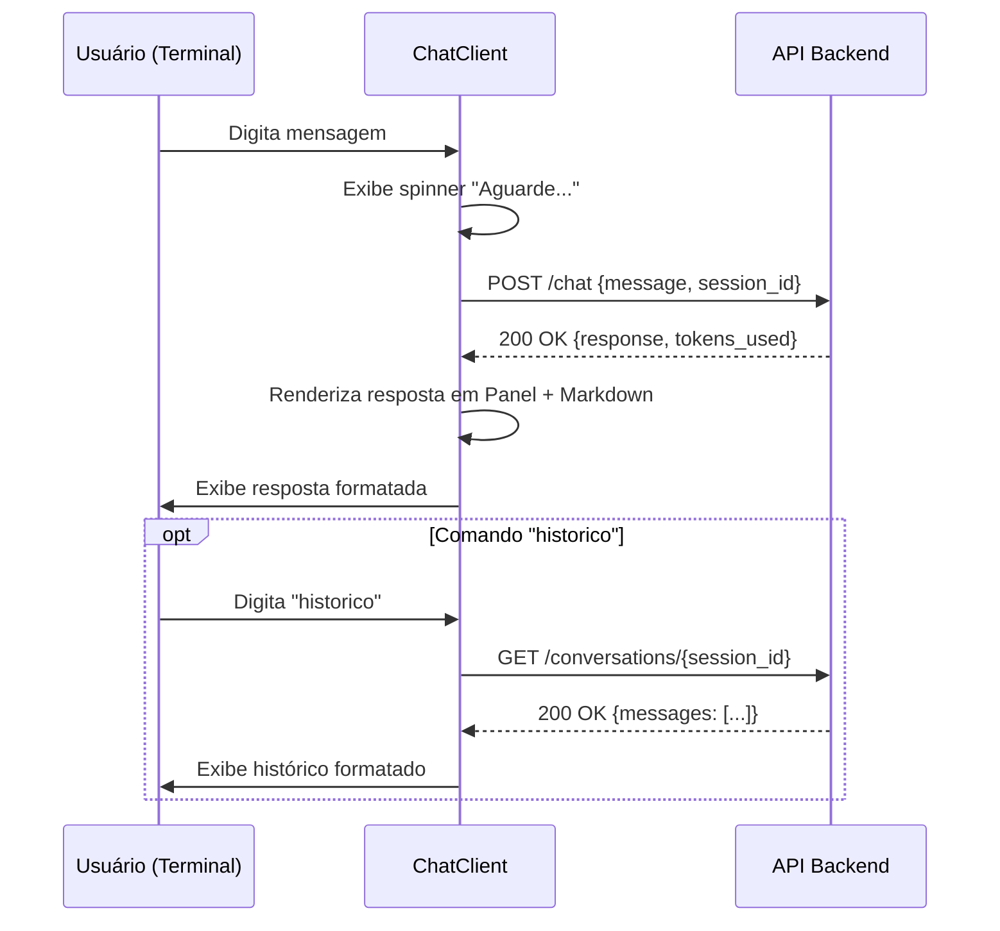

# 🤖 Gemini ChatBot - Cliente TUI (Text User Interface)

> Documentação técnica do cliente de terminal para interação com a API de ChatBot

```
┌─────────────────────────────────────────┐
│  🤖 Gemini ChatBot - Cliente TUI        │
│  Versão: 1.0.0                          │
│  Interface: Terminal (Rich)             │
│  Protocolo: HTTP/REST + JSON            │
└─────────────────────────────────────────┘
```

## 📑 Índice

1. [Visão Geral](#-visão-geral)
2. [Pré-requisitos](#-pré-requisitos)
3. [Instalação](#-instalação)
4. [Uso Rápido](#-uso-rápido)
5. [Configuração](#-configuração)
6. [Comandos Disponíveis](#-comandos-disponíveis)
7. [Interface do Usuário](#-interface-do-usuário)
8. [Comunicação com a API](#-comunicação-com-a-api)
9. [Tratamento de Erros](#-tratamento-de-erros)
10. [Arquitetura do Código](#-arquitetura-do-código)
11. [Exemplos de Uso](#-exemplos-de-uso)
12. [Solução de Problemas](#-solução-de-problemas)
13. [Referência da API](#-referência-da-api)
14. [Contribuindo](#-contribuindo)


## 👁️ Visão Geral

O **ChatClient TUI** é uma aplicação de linha de comando desenvolvida em Python que permite interagir com um backend de ChatBot através de uma interface de terminal rica e formatada.

### ✨ Principais Características

| Característica | Descrição |
|---------------|-----------|
| 🎨 **Interface Rica** | Cores, formatação Markdown, painéis e animações via biblioteca `rich` |
| 🔗 **Comunicação HTTP** | Requisições RESTful para API backend usando `requests` |
| 🆔 **Sessões Isoladas** | UUID único por instância para isolamento de conversas |
| 🛡️ **Resiliência** | Tratamento robusto de erros de rede, API e interrupções |
| ⚡ **Feedback Visual** | Spinner de carregamento e mensagens de status em tempo real |
| 🔧 **Configuração Flexível** | Suporte a variáveis de ambiente e argumentos de linha de comando |

### 🎯 Casos de Uso

```bash
# Desenvolvimento local
python chat_client.py 127.0.0.1

# Acesso a servidor remoto
python chat_client.py 192.168.1.100

# Deploy com configuração via ambiente
API_URL=https://api.producao.com python chat_client.py ignored

# Integração em scripts automatizados
python -c "from chat_client import ChatClient; c = ChatClient('10.0.0.1')"
```


## ⚙️ Pré-requisitos

### Software Necessário

| Componente | Versão Mínima | Como Verificar |
|-----------|--------------|----------------|
| Python | 3.8+ | `python --version` |
| pip | 21.0+ | `pip --version` |

### Dependências Python

```txt
# requirements.txt
requests>=2.28.0    # Cliente HTTP para comunicação com a API
rich>=12.0.0        # Biblioteca para TUI formatada e colorida
```

### Instalação das Dependências

```bash
# Via pip tradicional
pip install -r requirements.txt

# Via uv (gerenciador moderno)
uv pip install -r requirements.txt

# Instalação individual
pip install requests rich
```


## 🚀 Instalação

### Método 1: Clone do Repositório

```bash
# Clonar repositório
git clone https://github.com/seu-usuario/gemini-chatbot.git
cd gemini-chatbot/client

# Instalar dependências
pip install -r requirements.txt

# Verificar instalação
python chat_client.py --help 2>&1 | head -1
# Output esperado: "Por favor forneça o IP do servidor"
```

### Método 2: Instalação Direta

```bash
# Baixar apenas o cliente
curl -O https://raw.githubusercontent.com/seu-usuario/gemini-chatbot/main/client/chat_client.py
curl -O https://raw.githubusercontent.com/seu-usuario/gemini-chatbot/main/client/requirements.txt

# Instalar dependências
pip install -r requirements.txt
```

### Método 3: Via uv (Recomendado para Desenvolvimento)

```bash
# Instalar uv (se ainda não tiver)
pip install uv

# Criar ambiente virtual e instalar deps
uv venv
source .venv/bin/activate  # Linux/Mac
# ou
.venv\Scripts\activate  # Windows

uv pip install -r requirements.txt
```


## 🎮 Uso Rápido

### Sintaxe Básica

```bash
python chat_client.py <IP_DO_SERVIDOR>
```

### Exemplos Práticos

```bash
# 🔹 Conectar ao localhost (servidor local)
python chat_client.py 127.0.0.1

# 🔹 Conectar a servidor na rede local
python chat_client.py 192.168.1.100

# 🔹 Conectar a servidor remoto
python chat_client.py 203.0.113.42

# 🔹 Usar URL completa via variável de ambiente
API_URL=https://api.meudominio.com:8443 python chat_client.py ignored

# 🔹 Executar em script Python
python -c "
from chat_client import ChatClient
client = ChatClient('192.168.1.100')
# client.start_chat()  # Descomente para iniciar interativamente
"
```

### Fluxo de Interação Típico

```
$ python chat_client.py 192.168.1.100
┌─────────────────────────────────┐
│ 🤖 Gemini ChatBot               │
│ Sessão: a1b2c3d4-e5f6-...       │
│ Digite 'sair' para encerrar...  │
└─────────────────────────────────┘

Você: Olá, como funciona machine learning?
⠋ Aguarde...
┌─ 🤖 Assistente ──────────────────┐
│                                  │
│ Machine Learning é um campo...   │
│                                  │
│ • Coleta de dados                │
│ • Treinamento de modelos         │
│ • Validação e teste              │
│                                  │
└─ Tokens usados: 156 ─────────────┘

Você: ajuda
┌─ Ajuda ──────────────────────────┐
│ Comandos disponíveis:            │
│ • sair   - Encerra o chat        │
│ • historico - Mostra histórico   │
│ • ajuda  - Mostra esta mensagem  │
│                                  │
│ Exemplos de perguntas:           │
│ • "Explique machine learning"    │
│ • "Como debugar código Python?"  │
└──────────────────────────────────┘

Você: sair
Até logo! 👋
```


## ⚙️ Configuração

### Prioridade de Configuração da URL da API

O cliente determina a URL da API seguindo esta ordem de prioridade:

```
1️⃣ Variável de ambiente API_URL (maior prioridade)
   ↓
2️⃣ Argumento de linha de comando + porta padrão 8000
   ↓
3️⃣ Fallback: http://localhost:8000
```

### Métodos de Configuração

#### Método 1: Argumento de Linha de Comando (Padrão)

```bash
# Sintaxe
python chat_client.py <IP_OU_HOST>

# Exemplos
python chat_client.py 192.168.1.100
# → Conecta em: http://192.168.1.100:8000

python chat_client.py api.meudominio.com
# → Conecta em: http://api.meudominio.com:8000
```

#### Método 2: Variável de Ambiente `API_URL`

```bash
# Linux/Mac
export API_URL="https://api.producao.com:8443"
python chat_client.py ignored  # Argumento é ignorado

# Windows (CMD)
set API_URL=https://api.producao.com:8443
python chat_client.py ignored

# Windows (PowerShell)
$env:API_URL="https://api.producao.com:8443"
python chat_client.py ignored

# Uso temporário (one-liner)
API_URL=https://api.teste.com python chat_client.py ignored
```

#### Método 3: Configuração Programática

```python
# Importar e configurar via código
from chat_client import ChatClient

# Opção A: Via argumento
client = ChatClient("192.168.1.100")

# Opção B: Via variável de ambiente (definida antes da import)
import os
os.environ["API_URL"] = "https://api.custom.com"
client = ChatClient("ignored")  # Será ignorado

client.start_chat()
```

### Tabela de Configurações

| Configuração | Tipo | Padrão | Descrição |
|-------------|------|--------|-----------|
| `API_URL` | Variável de ambiente | `None` | URL completa da API (sobrescreve IP) |
| `ip_servidor` | Argumento posicional | *Obrigatório* | IP ou hostname do servidor |
| Porta da API | Implícita | `8000` | Porta padrão se não usar `API_URL` |
| `session_id` | Gerado internamente | UUID v4 | Identificador único da sessão |

## 🗂️ Comandos Disponíveis

### Comandos de Controle

| Comando | Sinônimos | Descrição | Exemplo |
|---------|-----------|-----------|---------|
| `sair` | `exit`, `quit` | Encerra a sessão de chat | `Você: sair` → "Até logo! 👋" |
| `ajuda` | `help` | Exibe menu de ajuda com comandos | `Você: ajuda` → Mostra lista |
| `historico` | — | Busca e exibe histórico do servidor | `Você: historico` → Lista mensagens |

> 💡 **Dica**: Comandos são **case-insensitive**. `SAIR`, `Sair` e `sair` funcionam igualmente.

### Comportamento de Entradas Especiais

| Entrada | Comportamento |
|---------|--------------|
| *(string vazia ou só espaços)* | Ignorada, novo prompt exibido |
| `Ctrl+C` | Interrupção graciosa com mensagem de erro |
| Texto normal | Enviado como mensagem para a API |

### Exemplos de Perguntas

```text
• "Explique o que é machine learning"
• "Como funciona um neural network?"
• "Me ajude a debugar um código Python"
• "Quais são as melhores práticas para APIs REST?"
• "Crie um exemplo de classe em Python com herança"
```

## 🎨 Interface do Usuário

### Elementos Visuais (Rich)

O cliente utiliza a biblioteca `rich` para proporcionar uma experiência de terminal enriquecida:

#### 📦 Painéis (Panels)

```python
# Banner inicial
Panel.fit(
    "[bold blue]🤖 Gemini ChatBot[/bold blue]\n"
    f"[dim]Sessão: {session_id}[/dim]\n"
    "Digite 'sair' para encerrar ou 'ajuda' para comandos",
    border_style="green"
)
```

**Renderização:**
```
┌─────────────────────────────────┐
│ 🤖 Gemini ChatBot               │
│ Sessão: abc123-def456-...       │
│ Digite 'sair' para encerrar...  │
└─────────────────────────────────┘
```

#### 🎨 Estilos de Texto Disponíveis

| Tag Rich | Efeito Visual | Uso no Código |
|----------|--------------|---------------|
| `[bold]...[/bold]` | **Negrito** | Títulos, roles de mensagem |
| `[dim]...[/dim]` | Texto esmaecido | Metadados, timestamps |
| `[yellow]...[/yellow]` | 🟡 Cor amarela | Prompt do usuário, comandos |
| `[green]...[/green]` | 🟢 Cor verde | Sucesso, assistente |
| `[red]...[/red]` | 🔴 Cor vermelha | Erros, alertas |
| `[blue]...[/blue]` | 🔵 Cor azul | Títulos, informações |
| `[cyan]...[/cyan]` | 🔷 Cor ciano | Histórico, destaque |

#### 📝 Renderização de Markdown

```python
from rich.markdown import Markdown

response_text = "## Título\n• Item 1\n• Item 2\n`código`"
md = Markdown(response_text)
console.print(Panel(md, ...))
```

**Suporta:**
- ✅ Títulos (`#`, `##`, `###`)
- ✅ Listas ordenadas e não ordenadas
- ✅ Código inline (`backticks`) e blocos de código
- ✅ **Negrito** e *itálico*
- ✅ Links e imagens (texto alternativo)
- ✅ Tabelas básicas

#### 🔄 Spinner de Carregamento

```python
with console.status("[bold green]Aguarde...[/bold green]", spinner="dots"):
    response = _send_message(user_input)
```

**Spinners disponíveis no Rich:** `dots`, `line`, `pong`, `simpleDots`, `monkey`, entre outros.


## 🌐 Comunicação com a API

### Endpoints Utilizados

#### 1. Envio de Mensagem (`POST /chat`)

```http
POST /chat HTTP/1.1
Host: {base_url}
Content-Type: application/json

{
  "message": "Texto da mensagem do usuário",
  "session_id": "uuid-da-sessão-atual"
}
```

**Resposta Esperada (200 OK):**
```json
{
  "response": "Texto da resposta do assistente em Markdown",
  "tokens_used": 142
}
```

**Código Correspondente:**
```python
def _send_message(self, message: str) -> dict:
    payload = {
        "message": message,
        "session_id": self.session_id
    }
    
    response = requests.post(
        f"{self.base_url}/chat",
        json=payload,
        headers={"Content-Type": "application/json"}
    )
    
    if response.status_code != 200:
        raise Exception(f"Erro na API: {response.text}")
    
    return response.json()
```

#### 2. Busca de Histórico (`GET /conversations/{session_id}`)

```http
GET /conversations/a1b2c3d4-e5f6-... HTTP/1.1
Host: {base_url}
```

**Resposta Esperada (200 OK):**
```json
{
  "messages": [
    {
      "role": "user",
      "content": "Pergunta do usuário",
      "timestamp": "2024-01-15T10:30:00Z"
    },
    {
      "role": "assistant",
      "content": "Resposta do assistente",
      "timestamp": "2024-01-15T10:30:05Z"
    }
  ]
}
```

**Código Correspondente:**
```python
def _show_history(self):
    response = requests.get(f"{self.base_url}/conversations/{self.session_id}")
    if response.status_code == 200:
        conversation = response.json()
        # ... exibe mensagens formatadas
```

### Fluxo de Comunicação



### Headers e Configurações HTTP

| Header | Valor | Propósito |
|--------|-------|-----------|
| `Content-Type` | `application/json` | Indica payload JSON nas requisições POST |
| *(Autenticação)* | *Não implementado* | Reservado para futuras versões com JWT |

> ⚠️ **Nota**: Atualmente não há suporte a autenticação. Adicione headers de autorização se sua API exigir.


## 🛡️ Tratamento de Erros

### Matriz de Erros e Comportamentos

| Tipo de Erro | Condição | Ação do Cliente | Mensagem ao Usuário |
|-------------|----------|----------------|-------------------|
| **Argumento ausente** | `len(sys.argv) <= 1` | `exit(1)` | `"Por favor forneça o IP do servidor"` |
| **KeyboardInterrupt** | `Ctrl+C` pressionado | `break` no loop | `"[red]Interrompido pelo usuário[/red]"` |
| **HTTP Error (API)** | `status_code != 200` | `raise Exception` | `"[red]Erro na API: {response.text}[/red]"` |
| **Erro de Rede** | Timeout, DNS, conexão recusada | `except Exception` | `"[red]Erro: {mensagem}[/red]"` |
| **Histórico não encontrado** | `GET /conversations` retorna 404 | Continua execução | `"[yellow]Nenhum histórico encontrado[/yellow]"` |
| **Campo ausente no JSON** | `.get("chave")` retorna `None` | Usa valor padrão | Sem erro, usa fallback |

### Padrões de Resiliência Implementados

```python
# ✅ Acesso seguro a dicionários com fallback
response_text = response.get("response", "Sem resposta")
tokens_used = response.get("tokens_used", 0)

# ✅ Try-except granular para diferentes cenários
try:
    # Operação potencialmente falha
except KeyboardInterrupt:
    # Tratamento específico para interrupção
except Exception as e:
    # Catch-all para erros inesperados

# ✅ Validação prévia de status HTTP
if response.status_code != 200:
    raise Exception(f"Erro na API: {response.text}")
```

### Boas Práticas de Tratamento de Erro

1. **Fail-fast**: Validações no início para evitar processamento desnecessário
2. **Feedback claro**: Mensagens em cores distintas para sucesso (verde) e erro (vermelho)
3. **Graceful degradation**: Histórico ausente não quebra o chat principal
4. **Logs implícitos**: Mensagens de erro incluem detalhes da resposta da API para debug


## 🏗️ Arquitetura do Código

### Diagrama de Classes

```
┌─────────────────────────────┐
│        ChatClient           │
├─────────────────────────────┤
│ - base_url: str             │
│ - session_id: str           │
│ - console: Console          │
├─────────────────────────────┤
│ + __init__(ip_servidor)     │
│ + start_chat()              │
│ - _send_message(msg) → dict │
│ - _display_response(resp)   │
│ - _show_help()              │
│ - _show_history()           │
└─────────────────────────────┘
```

### Estrutura de Métodos

#### 🔹 Método Público

| Método | Responsabilidade | Chamado Por |
|--------|-----------------|-------------|
| `__init__(ip_servidor)` | Inicializa URL, session_id e console | Instanciação da classe |
| `start_chat()` | Loop principal de interação com usuário | `__main__` ou código externo |

#### 🔹 Métodos Privados (Internos)

| Método | Responsabilidade | Retorna |
|--------|-----------------|---------|
| `_send_message(message)` | Envia POST para `/chat`, valida resposta | `dict` com resposta da API |
| `_display_response(response)` | Renderiza resposta em Panel formatado | `None` (efeito colateral: print) |
| `_show_help()` | Exibe menu de ajuda em painel | `None` |
| `_show_history()` | Busca e exibe histórico do servidor | `None` |

### Fluxo de Execução

```mermaid
flowchart TD
    A[Início: python chat_client.py IP] --> B{IP fornecido?}
    B -->|Não| C[Exibe erro e encerra]
    B -->|Sim| D[Instancia ChatClient]
    
    D --> E[Configura: base_url, session_id, console]
    E --> F[Chama start_chat()]
    
    F --> G[Exibe banner inicial]
    G --> H[🔄 Loop Principal]
    
    H --> I[Captura input do usuário]
    I --> J{É comando especial?}
    
    J -->|sair/exit/quit| K[Exibe despedida + break]
    J -->|ajuda/help| L[Chama _show_help() + continue]
    J -->|historico| M[Chama _show_history() + continue]
    J -->|vazio| N[Ignora + continue]
    J -->|mensagem normal| O[Envia para API com spinner]
    
    O --> P[Recebe resposta JSON]
    P --> Q[Renderiza em Panel + Markdown]
    Q --> H
    
    K --> R[Fim do programa]
    
    style A fill:#e1f5fe
    style R fill:#c8e6c9
    style O fill:#fff3e0
```


## 💡 Exemplos de Uso

### Exemplo 1: Sessão Interativa Básica

```bash
$ python chat_client.py 192.168.1.100
┌─────────────────────────────────┐
│ 🤖 Gemini ChatBot               │
│ Sessão: f4a7b2c1-9e3d-...       │
│ Digite 'sair' para encerrar...  │
└─────────────────────────────────┘

Você: Qual a diferença entre lista e tupla em Python?
⠋ Aguarde...
┌─ 🤖 Assistente ────────────────────────────┐
│                                            │
│ ## Lista vs Tupla em Python                │
│                                            │
│ | Característica | Lista | Tupla│          │
│ |---------------|-------|-------│          │    
│ | Mutável       | ✅    | ❌    │          │
│ | Sintaxe       | `[]`  | `()`  │          │
│ | Performance   | Mais lenta | Mais rápida││
│                                            │
│ **Use lista** quando precisar              │
│ modificar os elementos.                    │
│                                            │
└─ Tokens usados: 98 ────────────────────────┘

Você: historico
📜 Histórico da Conversa:

👤 Você: Qual a diferença entre lista e tupla em Python?
10:30:00

🤖 Assistente: ## Lista vs Tupla em Python...
10:30:05

Você: sair
Até logo! 👋
```

### Exemplo 2: Uso com Variável de Ambiente

```bash
# Configurar para ambiente de produção
export API_URL="https://chat-api.empresa.com:8443"

# Executar (argumento é ignorado)
python chat_client.py ignored

# Output:
# 🚀 Conectando a: https://chat-api.empresa.com:8443
# 🆔 Sessão: abc123...
```

### Exemplo 3: Integração Programática

```python
# script_automatizado.py
from chat_client import ChatClient
import sys

def main():
    # Configurar cliente
    client = ChatClient("10.0.0.50")
    
    # Enviar mensagem programaticamente (bypass do loop interativo)
    resposta = client._send_message("Qual a data atual?")
    print(f"Resposta da API: {resposta['response']}")
    
    # Ou iniciar modo interativo
    # client.start_chat()

if __name__ == "__main__":
    main()
```

### Exemplo 4: Teste de Conexão Rápido

```bash
# Testar se a API está respondendo (sem iniciar chat completo)
python -c "
import requests
import sys
ip = sys.argv[1] if len(sys.argv) > 1 else '127.0.0.1'
try:
    r = requests.get(f'http://{ip}:8000/health', timeout=5)
    print(f'✅ API online: {r.status_code}')
except Exception as e:
    print(f'❌ API offline: {e}')
" 192.168.1.100
```


## 🔍 Solução de Problemas

### Problemas Comuns e Soluções

#### ❌ "Por favor forneça o IP do servidor"

**Causa**: Execução sem argumento de IP e sem `API_URL` definida.

**Solução**:
```bash
# Opção A: Fornecer IP
python chat_client.py 192.168.1.100

# Opção B: Usar variável de ambiente
export API_URL=http://192.168.1.100:8000
python chat_client.py ignored
```

#### ❌ "Erro na API: 404 Not Found"

**Causa**: Endpoint `/chat` não existe ou URL incorreta.

**Solução**:
```bash
# Verificar se a API está rodando
curl -I http://192.168.1.100:8000/health

# Verificar logs do servidor backend
# Confirmar que a rota POST /chat está registrada
```

#### ❌ "Erro: HTTPConnectionPool... Max retries exceeded"

**Causa**: Servidor inacessível (firewall, servidor offline, IP errado).

**Solução**:
```bash
# Testar conectividade básica
ping 192.168.1.100

# Testar porta específica
telnet 192.168.1.100 8000
# ou
nc -zv 192.168.1.100 8000

# Verificar firewall
sudo ufw status  # Linux
netsh advfirewall firewall show rule name=all  # Windows
```

#### ❌ "Erro: Expecting value: line 1 column 1 (char 0)"

**Causa**: API retornou HTML (erro 500/404) em vez de JSON.

**Solução**:
```bash
# Verificar resposta bruta da API
curl -X POST http://192.168.1.100:8000/chat \
  -H "Content-Type: application/json" \
  -d '{"message":"test","session_id":"abc"}'

# Checar logs do backend para erros de serialização JSON
```

#### ❌ Formatação Rich não aparece (texto cru com tags)

**Causa**: Terminal não suporta cores ou biblioteca Rich não instalada.

**Solução**:
```bash
# Verificar instalação do Rich
python -c "import rich; print(rich.__version__)"

# Reinstalar se necessário
pip install --force-reinstall rich

# Forçar modo colorido (se o terminal suportar)
export FORCE_COLOR=1
python chat_client.py 127.0.0.1
```

### Comandos de Debug Úteis

```bash
# Verificar versão das dependências
pip list | grep -E "requests|rich"

# Testar requisição manual à API
curl -X POST http://localhost:8000/chat \
  -H "Content-Type: application/json" \
  -d '{"message":"ping","session_id":"test-123"}' \
  -v

# Executar cliente com output Python detalhado
python -v chat_client.py 127.0.0.1 2>&1 | grep -E "requests|rich|ERROR"

# Verificar se a porta está em uso
lsof -i :8000  # Linux/Mac
netstat -ano | findstr :8000  # Windows
```

## 📚 Referência da API Backend

> ⚠️ Esta seção descreve os endpoints esperados pelo cliente. Consulte a documentação do seu backend para detalhes específicos.

### Endpoint: `POST /chat`

**Descrição**: Envia uma mensagem do usuário e recebe a resposta do assistente.

**Request**:
```http
POST /chat HTTP/1.1
Content-Type: application/json

{
  "message": "<string>",      # Texto da mensagem do usuário (obrigatório)
  "session_id": "<uuid>"      # Identificador da sessão (obrigatório)
}
```

**Response (200 OK)**:
```json
{
  "response": "<string>",     # Resposta do assistente em formato Markdown
  "tokens_used": <integer>    # Número de tokens processados (opcional)
}
```

**Códigos de Status**:
| Status | Significado | Ação do Cliente |
|--------|-------------|----------------|
| `200` | Sucesso | Processa e exibe resposta |
| `400` | Bad Request | Exibe erro da API |
| `401/403` | Não autorizado | Exibe erro (auth não implementada) |
| `404` | Not Found | Exibe erro de endpoint |
| `500` | Server Error | Exibe erro interno |

### Endpoint: `GET /conversations/{session_id}`

**Descrição**: Recupera o histórico completo de uma sessão de chat.

**Request**:
```http
GET /conversations/a1b2c3d4-e5f6-7890-abcd-ef1234567890 HTTP/1.1
```

**Response (200 OK)**:
```json
{
  "messages": [
    {
      "role": "user|assistant",  # Quem enviou a mensagem
      "content": "<string>",      # Conteúdo da mensagem
      "timestamp": "<ISO8601>"    # Data/hora do envio
    }
  ]
}
```

**Response (404 Not Found)**:
```json
{
  "error": "Session not found"
}
```

## 🤝 Contribuindo

### Reportando Bugs

1. Verifique se o bug já foi reportado nas [Issues](link-para-issues)
2. Inclua na reportagem:
   - Versão do Python e das dependências
   - Sistema operacional
   - Passos para reproduzir
   - Output do erro (com `python -v` se possível)
   - Configuração de rede/API utilizada

### Sugestões de Melhoria

Estamos abertos a contribuições! Algumas ideias para futuras versões:

```python
# 🎯 Funcionalidades Planejadas
[ ] Autenticação JWT/OAuth2
[ ] Streaming de resposta (Server-Sent Events)
[ ] Upload de arquivos/anexos nas mensagens
[ ] Cache local de histórico para modo offline
[ ] Temas personalizáveis para a TUI
[ ] Suporte a múltiplos modelos de IA
[ ] Comandos slash estilo Discord (/modelo, /reset, /export)
[ ] Integração com clipboard para copiar respostas
```

### Pull Requests

1. Fork o repositório
2. Crie uma branch para sua feature: `git checkout -b feature/minha-feature`
3. Commit suas mudanças: `git commit -am 'Adiciona feature X'`
4. Push para a branch: `git push origin feature/minha-feature`
5. Abra um Pull Request descrevendo as mudanças

### Padrões de Código

```python
# ✅ Siga estas convenções:
• Docstrings em todos os métodos públicos
• Type hints para parâmetros e retornos
• Nomes de métodos privados com prefixo underscore (_)
• Tratamento de exceções específico, evite bare except
• Comentários apenas quando o "porquê" não for óbvio

# 📏 Formatação
• Use black ou autopep8 para formatação automática
• Linha máxima: 88 caracteres (padrão black)
• Imports organizados: stdlib → third-party → local
```